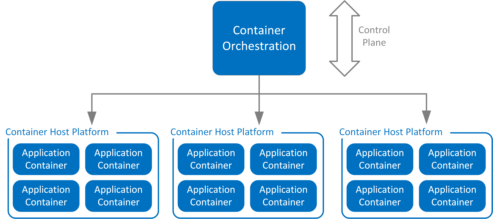
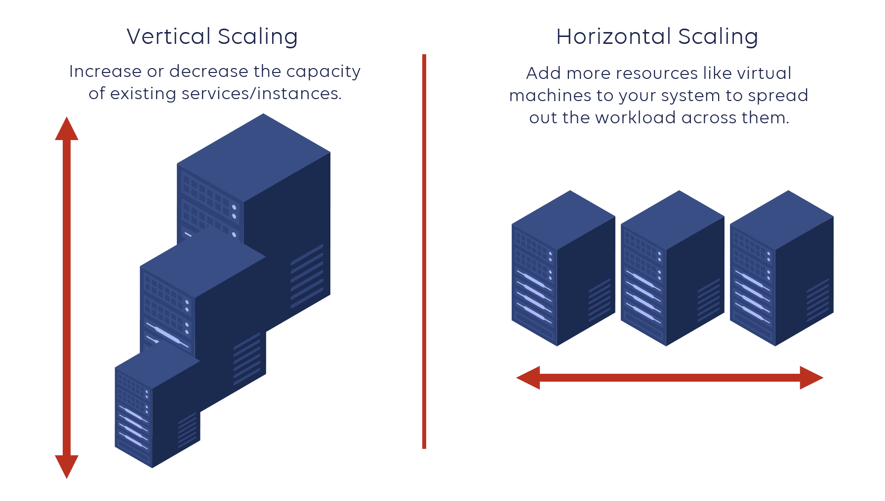

## Warum braucht man Container-Orchestrierung?
- Orchestrators stellen sicher, dass alle Dinge die zur Ausführung eines Programms nötig sind,
vorhanden sind.
- Wenn eine Node ausfällt wird sie automatisch ersetzt
## Wie funktioniert Container-Orchestrierung?
Sie stellt Programme automatisch bereit und kann sie skalieren.

## Welche Container-Orchestrierung Technologien kennen Sie?
- Docker Swarm
- Kubernetes
- OpenShift
## Was versteht man unter "Scaling Containers"?
Man kann horizontal und vertikal scalen. Vertikal ist wenn man mehr CPU/RAM Leistung integriert. Horizontal ist das verteilen auf mehr Containers

## Was gibt es für Deployment Strategien?
- Big Bang Deployment
- Continuous Deployment (CD)
- Blue-Green Deploy
- Canary Deployment
- Shadow Deployment
- Ramped Deployment & Rolling Deployment
- Recreate Deployment
- A/B Testing Deployment