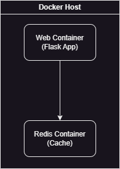

## Was ist Redis?
Redis ist eine NoSQL in-memory Datenbank. 
Weil sie sehr schnell ist wird sie häufig als Cache benutzt.
## Welche Ports werden genutzt?
- 6379 für Redis
- 8000:5000 für Flask
## Was ist die Bedeutung von ENV im DOCKERFILE?
Damit werden environment Variablen für den Container gesetzt.